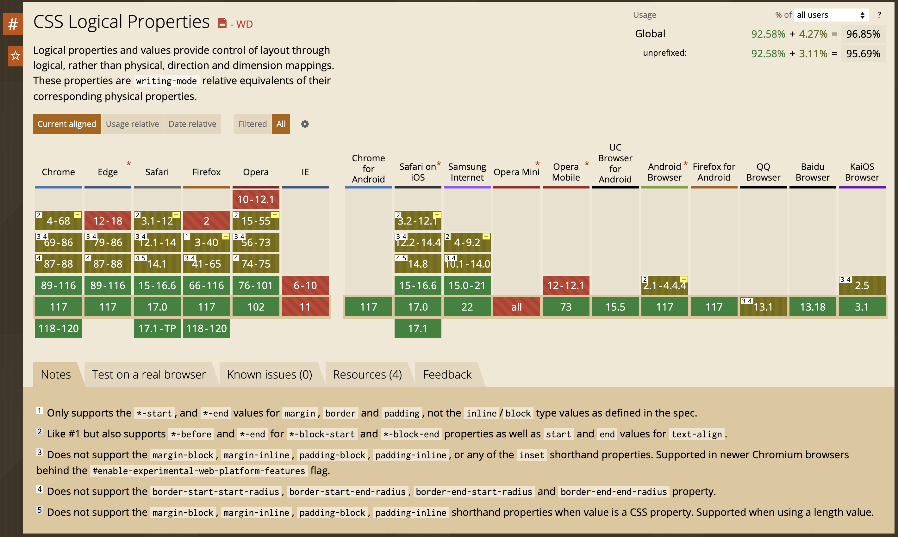
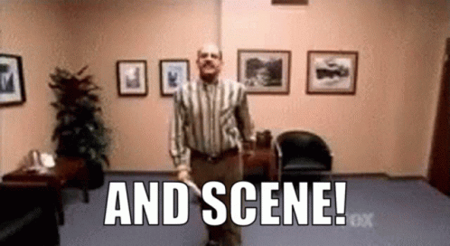

# CSS Logical vs Directional Properties

---
layout: quote
---

# We’re Not Retreating, We’re Just Advancing in a Different Direction.

– ⭐️⭐️⭐️⭐️ USA General Oliver P. Smith, 1950

<!--
Korean War
-->

---
layout: default
transition: slide-up
---

# Directional Properties

- `top`, `right`, `bottom`, `left` ("inset" properties)
- `border-{...}` (e.g. `border-top`)
- `float: left | right`
- `text-align: left | right`
- `margin`/`padding-{...}` (e.g. `margin-left`)

---
transition: slide-up
---

# The Problem with Directional Properties

Flow is subject to change

- Media queries
- Reading direction (`dir="rtl"`)
- `flex-direction: row-reverse | column-reverse`
- `writing-mode: vertical-rl | vertical-lr`
- etc.

---
level: 2
---

# The Solution: Logical Properties

Based on the writing mode and reading direction

- `text-align: left | right` ⇒ `text-align: start | end`
- `float: left | right` ⇒ `float: start | end`
- `top/bottom` ⇒ `block-start/block-end`
- `left/right` ⇒ `inline-start/inline-end`
- `border-top/bottom` ⇒ `border-block-start/block-end`
- `border-left/right` ⇒ `border-inline-start/inline-end`
- `border-top-right-radius` ⇒ `border-start-end-radius`
- `margin-left/right` ⇒ `margin-inline-start/inline-end`

---
layout: center
---


---
layout: two-cols-header
---

# What’s in It for You?

Some text here

::left::
<ul>
  <li>Support for RTL languages <em>out of the box</em></li>
  <li>No need for media queries or other flow specific rules</li>
  <li>Future proof</li>
  <li>Keep your CSS readable & maintainable</li>
  <li v-click="9">Bragging rights</li>
</ul>

::right::
```css {all|1-9|11-14|all}
.thing.directional {
  text-align: left;
  margin-right: 1rem;
}
:dir(rtl) .thing.directional {
  text-align: right;
  margin-left: 1rem;
  margin-right: unset;
}

.thing.logical {
  text-align: start;
  margin-inline-end: 1rem;
}
```

<style>
  li.slidev-vclick-target {
    transition-duration: 2s;
  }
</style>

<!--
**BE AWARE** So far only Firefox and Safari support the :dir() pseudo-class
-->


---
layout: two-cols-header
---

# I Can Change!
<style>
.box {
  box-sizing: border-box;
  display: flex;
  flex-wrap: wrap;
  align-content: center;
  padding: 2rem;
  background-color: var(--foreground);
  color: var(--background);

  &.box--block {
    border-block: 1rem solid blue;
  }

  &.box--inline {
    border-inline: 1rem solid blue;
  }
}
</style>

Think "block" and "inline" instead of "top/bottom" and "left/right"

::left::
```css
.border-block {
  border-block: 1rem solid blue;
}
.border-inline {
  border-inline: 1rem solid blue;
}
```

::right::

<div class="flex gap-16 items-center justify-evenly">
  <div class="box box--block">border-block</div>
  <div class="box box--inline">border-inline</div>
</div>

---
layout: image
---

# Great! Can I Use It?



<p class="text-right text-sm">Source: 04-10-2023 https://caniuse.com/css-logical-props</p>

<!-- Well, right now -->

---
layout: two-cols
transition: slide-down
---

# Use the CSS Cascade
## Order of Appearance

```css {all|2-6|8-11|all}
.thing {
  /* Ye olde directional properties */
  padding-left: 1rem;
  padding-right: 1rem;
  margin-top: 42px;
  border-bottom-right-radius: 50%;

  /* New & shiny logical properties */
  padding-inline: 1rem;
  margin-block-start: 42px;
  border-end-end-radius: 50%;
}
```

---
layout: image
image: tobias-funke-and-scene.gif
transition: fade-out
---

<!--  -->

---
